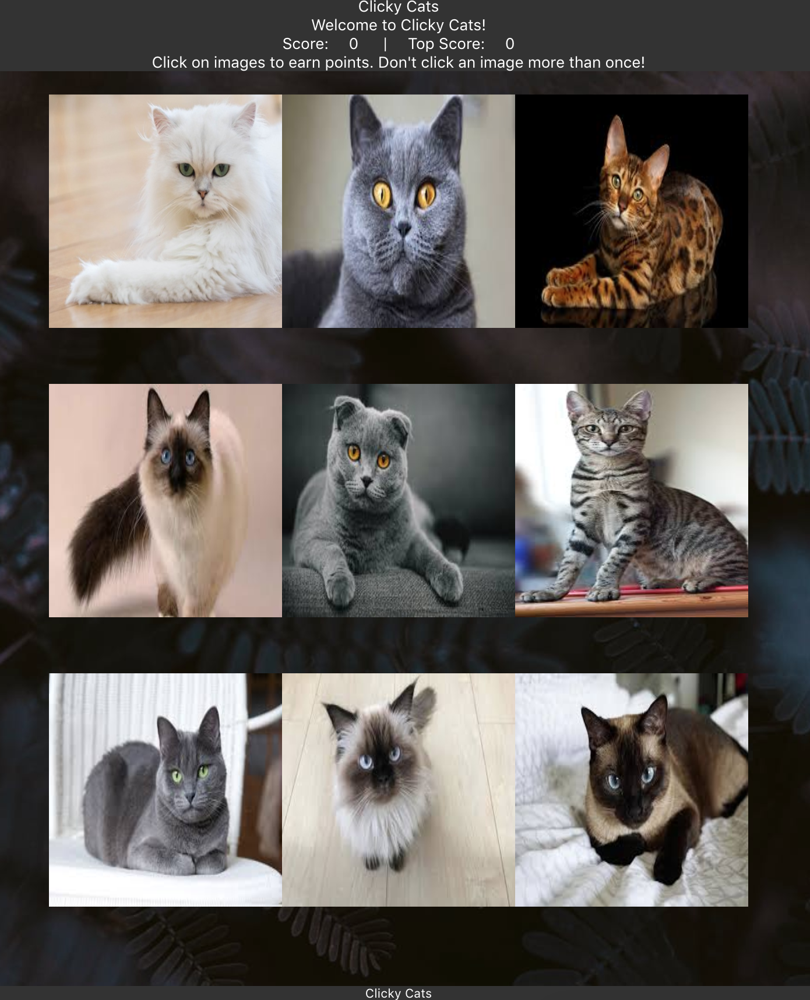

## Clicky Cat

`Created by Zuoyi Phang`

## Introduction

### Heroku
https://unc-19-clicky-cats.herokuapp.com/

### About

'ClickyCats' is a simple React application designed to test a user's memory. Users will attempt to click as many cards as possible in one game session without clicking the same card twice. This app is fully responsive.

## Technologies Used:

This application utilizes React for its front-end and Bootstrap for its CSS framework.

